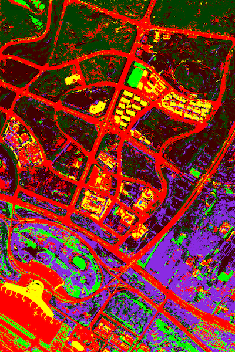

# TAFFN

This is an implementation for "Triplet Attention Feature Fusion Network for SAR and Optical Image Land Cover Classification".

```
python TAFFN/main.py
```

## Abstract

> With recent advances in remote sensing, abundant multimodal data are available for applications. However, considering the redundancy and the huge domain differences among multimodal data, how to effectively integrate these data is becoming important and challenging. In this paper, we proposed a triplet attention feature fusion network (TAFFN) for SAR and optical image fusion classification. Specifically, spatial attention module and spectral attention module based on self-attention mechanism are developed to extract spatial and spectral long-range information from the SAR image and optical image respectively, at the same time, cross-attention mechanism is proposed to capture the long-range interactive representation. Triplet attentions are concatenated to further integrate the complementary information of SAR and optical images. Experiments on a SAR and optical multimodal dataset demonstrate that the proposed method can achieve the state-of-the-arts performance.

The dataset reflects the land cover of the Ordos airport. It consists of a SAR image and an optical image with the image resolution .


The result of land cover classification map is shown below.


